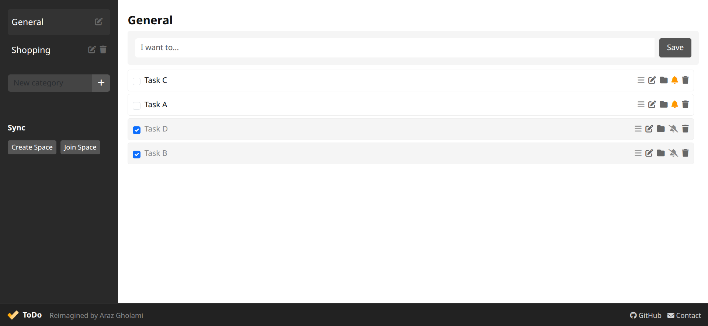

# ToDo

A server-less, modern, feature-rich todo application built with HTML, CSS, and JavaScript. This application provides a clean and intuitive interface for managing your tasks efficiently.
 
Live: [https://arazgholami.github.io/todo/](https://arazgholami.github.io/todo/)
  

## Features

- **Serverless Sync and Reminder**: Sync your tasks between your devices and set reminder for each one of your task without a server
- **Category Management**: Organize your tasks into custom categories with a default "General" category
- **Task Organization**: 
  - Create, edit, and delete tasks
  - Mark tasks as complete/incomplete
  - Move tasks between categories
  - Sort tasks by creation and completion dates
- **Responsive Design**: 
  - Fully responsive layout that works on both desktop and mobile devices
  - Collapsible sidebar for better mobile experience
- **Data Persistence**: All your tasks and categories are automatically saved in your browser's local storage
- **User-Friendly Interface**:
  - Clean and modern design
  - Intuitive task management
  - Easy category navigation
  - Quick task actions (edit, move, delete)
- **Visual Feedback**: Clear visual indicators for task status and category selection
- **Chrome App Support**:
  - Install as a Chrome extension
  - Access directly from Chrome toolbar
  - Works as a standalone app
- **Offline Functionality**:
  - Works without internet connection
  - Automatically syncs when online
  - Caches all necessary resources
  - Seamless offline experience

## Author

Created by Araz Gholami

# Contribution
You're welcome to help with anything.

# Licence
MIT

# Contact
Araz Gholami - Email: contact@arazgholami.com
