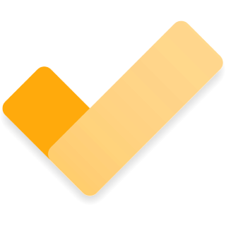

  
  <h1 align="center" style="display:inline; text-align: center;">Odak.app</h1>

  <strong>Modern, serverless, and feature-rich todo app—fully offline and local-first.</strong> 
  <a href="https://arazgholami.github.io/todo/">Try it online</a>

  
  
  

---

## About

**ToDo** is a clean, intuitive, and privacy-respecting task manager built with HTML, CSS, and JavaScript.  
No accounts, no ads, no cloud, and no distractions. All your tasks and categories are stored locally on your device.

> Stay organized, focused, and in control—wherever you are.

---

## Features

- **Reminders** – Set reminders for your tasks, all without a server  
- **Category Management** – Organize tasks into custom categories (with a default "General" category)  
- **Task Organization** – Create, edit, delete, complete, move, and sort tasks by creation/completion date  
- **Responsive Design** – Fully responsive layout with collapsible sidebar for mobile  
- **Local-First Storage** – All data is saved in your browser's local storage  
- **User-Friendly Interface** – Clean design, intuitive navigation, and quick task actions  
- **Visual Feedback** – Clear indicators for task status and category selection  
- **Chrome App Support** – Install as a Chrome extension or standalone app  
- **Offline Functionality** – Works offline, caches all resources for seamless experience  

---

## Screenshot

---

## Contributing

Pull requests and feedback are always welcome—whether it's a typo fix or a new feature idea, your input is appreciated.

Support development:

---

## License

This project is licensed under the **MIT License**.

---

## Contact

**Araz Gholami**  
Email: [contact@arazgholami.com](mailto:contact@arazgholami.com)  
Website: [arazgholami.com](https://arazgholami.com)